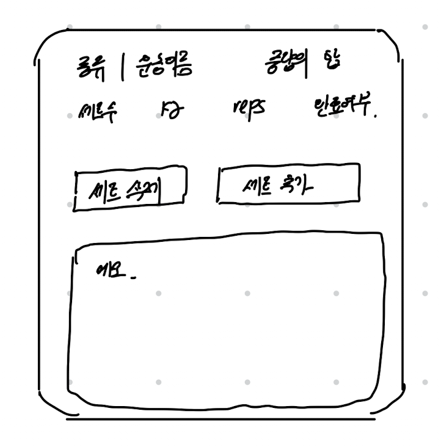
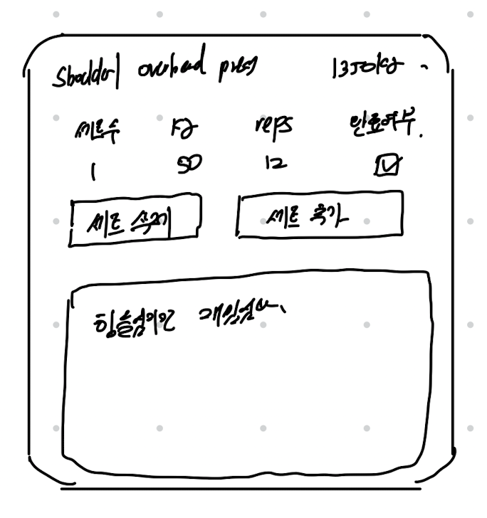
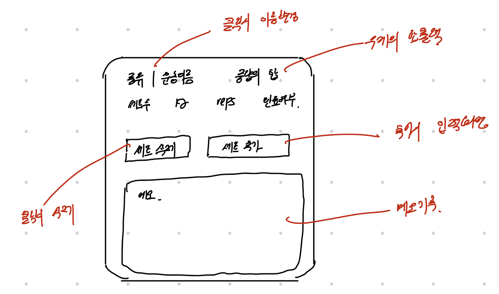
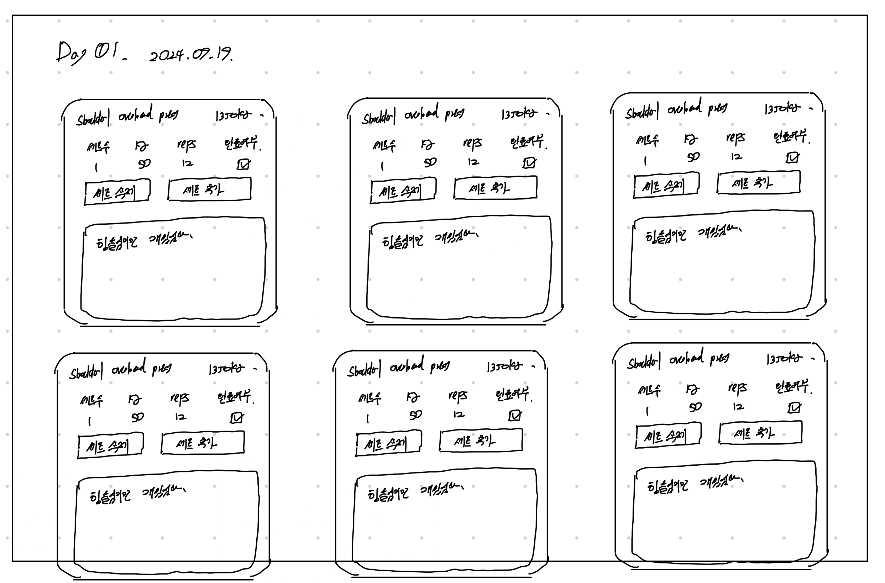

## 🏃 목표
- 운동에 대한 투두리스트 구현

  

## 🗒️ 필요성
- 기존에 헬스 앱을 이용하고 있었는데 정기결제를 진행.
	- 간단한 기능을 이용하기에, 직접 한번 이번 기회에 구현해보면 어떨까 했음
- 실제 내가 사용하고자 한 것을 만들고 싶었음.
	- 직접 사용하면서 불편함과 조금씩 확장하는 경험을 해볼 수 있을 것 같았음

  

## ✏️ 예상도
> 피그마로 그리면 좋았겠지만 똥손 이슈로 실패

|  |  |  |  |
| :---------------------: | :---------------------: | :---------------------: | :---------------------: |
|          설계 1           |          설계 2           |          설계 3           |          설계 4           |

- 최대한 여러 상태를 담아내고자 했음
	- 헬스 앱 `Burnfit`을 참고했음
- 우선은 작은 컴포넌트를 먼저 만들어보고, 그 다음에 `설계 4`처럼 확대할 예정
