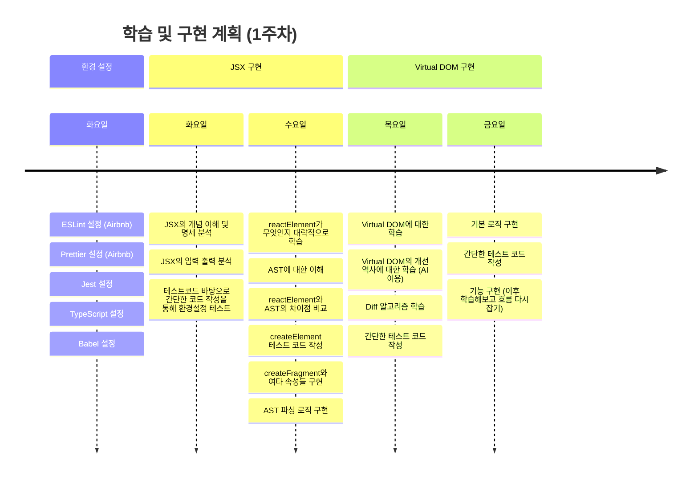

```mermaid
timeline
	title 학습 및 구현 계획 (1주차)
	section 환경 설정
	화요일 : ESLint 설정 (Airbnb)
		: Prettier 설정 (Airbnb)
		: Jest 설정
		: TypeScript 설정
		: Babel 설정
	section JSX 구현
	화요일 : JSX의 개념 이해 및 명세 분석
		: JSX의 입력 출력 분석
		: 테스트코드 바탕으로 간단한 코드 작성을 통해 환경설정 테스트
	수요일 : reactElement가 무엇인지 대략적으로 학습
		: AST에 대한 이해
		: reactElement와 AST의 차이점 비교
		: createElement 테스트 코드 작성
		: createFragment와 여타 속성들 구현
		: AST 파싱 로직 구현
	section Virtual DOM 구현
	목요일 : Virtual DOM에 대한 학습
		: Virtual DOM의 개선 역사에 대한 학습 (AI 이용)
		: Diff 알고리즘 학습
		: 간단한 테스트 코드 작성
	금요일 : 기본 로직 구현
		: 간단한 테스트 코드 작성
		: 기능 구현 (이후 학습해보고 흐름 다시 잡기)
```
