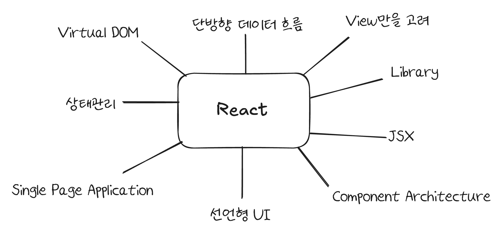
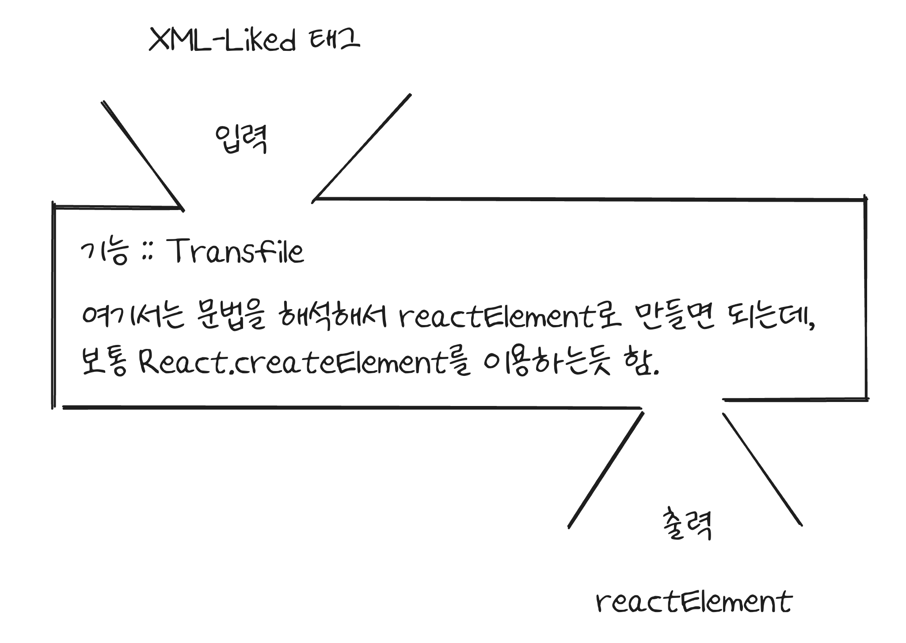

# 006 JSX 트랜스파일러 구현에 들어가며

## 👀 지난 시간을 돌아보며

고수들의 노하우를 얻겠다고 결심을 하고, `React`를 참고하겠다고 했던게 지난 내용이었다. 
그리고 그 방법은 이론과 인터페이스를 파악하고, 그 내부 기능을 내가 구현한 다음에 고수들은 어떻게 구현을 했는지 비교하는 형태로, 그들의 노하우를 얻는 형태로 진행하고자 한다.  

이유는 앞서 언급했다시피 문제 상황을 직접 겪으면서 해결했던 것은 이미 지난 4주간 했었다.  
이제는 거기에서 한발 나아가서, 문제 해결을 위해 나온 도구를 `Bottom-Up` 방식으로 익혀보면서 내가 보지 못한 것들을 보고, 배우고자 함이었다.   

그렇게 직접 `React`를 참고삼아 학습을 진행하기로 했다   

## ⚙️ 환경설정을 하면서 얻게 된 힌트

처음에 `React`와 같은 고수들의 문제 해결을 배워보자고 했을 때 어떻게 해야할 지 감이 잡히지 않았다. 
이미 이런 도구들은 오랜 시간 사용되어 오고, 유지보수되면서 많이 고도화되었기 때문이다.  

그래서 어떻게 할까 고민하던 중 다음과 같은 방법으로 방향을 잡게 되었다.  

어차피 이미 문제 상황에 대한 지식과 경험이 있으므로, 그리고 그 이상의 것은 내가 보지 못하는 게 있기 때문에, 그냥 프레임워크/라이브러리가 어떤 핵심 요소를 갖고 있는지를 파악한 후 그것을 기초로 해서 해결해보고자 했다.   

|  |
| :---------------------: |
|         리액트의 핵심         |

 

위와 같은 것들이 내가 부족하게나마 파악한 리엑트의 핵심이라고 생각한다. 
다만, 어디서부터 시작을 해야할 지 감을 잡지 못하고 있었다..  

너무 막막한 나머지, 각각이 무엇인지 간단하게나마 이해를 해보고.. 환경설정을 해보고 생각을 하기로 했다. 
다만, 복잡한나머지 어떻게 할 지에 대한 고민이 있었다.  

그래서, 처음 시작은 환경설정으로 시작하기로 했다. 막연하게 리액트 만들어보기로 목표를 잡고 그에 맞추어서 환경설정을 진행했다.  

내가 설정한 것은 다음과 같다. 

- Prettier, ESLint
- TypeScript
- Jest
- Babel

 

다만, `TypeScript`에 대해서는 막 공부하고 있기 때문에 설정이 굉장히 낯설었고 오래걸릴 것 같았다. 내가 집중하고자 하는 부분이 아니기에, 이는 `AI`에게 맡겨서 설정을 했다. 
이 과정에서 사용한 것은 `Claude`. 그런데 설정을 하면서 단순히 `Ctrl+c / v`를 한 것이 아니라 각각의 과정을 이해하고자 했다.  

그렇게 질문하는 과정에서 `JSX`에 대해서 생각보다 쉽게 트렌스파일 과정을 맛볼 수 있음을 알게 되었다. 
굉장히 복잡한 기능이 있겠지만, 내가 파악한 `JSX`의 동작은 다음과 같다.  

|  |
|:--------------------------:|
|         JSX 맛보기         |

 

위와 같은 형태로, 입력에 따른 출력이 명확하다는 것을 알게 되었다. 
그리고, `TypeScript` 컴파일러 옵션 중 다음과 같은 것을 설정하면, 내가 만든 `createElement`와 `createFragment`를 이식할 수 있다는 것도 알게 되었다.  

나는 이게 어떻게 최적화되고 그런 것을 배우려는 게 아니라, 기존에 `Tagged Template Literal`을 이용해서 구현했던 방식의 문제점을 `JSX`가 어떻게 해결을 했는지, 그 기능 구현에 대해서 배워보고자 하는 것이다. 
그렇기 때문에 `createElement` 부분에 집중을 하면 되었다.   

## 🧑‍💻 `jsx`에 대해서 어떻게, 무엇을 학습하고 구현해볼 건데?

`jsx`의 목적이나, 필요성, 그리고 효과 등에 대해서는 앞선 탐구를 통해서 배울 수 있었다. 
그러면 이제 남은 것은, `jsx`가 그러면 `js`로 어떻게 표현이 가능한지에 대해서 알고자 한다. 
정확히는, `createElement`를 통해서 `reactElement`로 바뀌는데, `reactElement`가 무엇이며, 기존에 `XML`을 `AST`로 바꾸는 것과 무엇이 다른지를 이해하고, 그런 다음에 `createElement`의 입력 출력을 파악해서 구현을 해보고자 한다.  

말이 복잡한데 정리하면 다음과 같다. 

| 과정                                                                         | 내용                                                                                                                                                   |
| -------------------------------------------------------------------------- | ---------------------------------------------------------------------------------------------------------------------------------------------------- |
| 1. `reactElement`가 무엇인지 대략적으로 학습한다.                                        | ▸ `JSX`의 최종 `output`이기 때문에 이를 이해하고자 한다.  ▸ 입력값은 너무 명확하기 때문이다.                                                                                |
| 2. `XML`이 해석될 때 `AST`로 바뀌는데, 이게 어떤 형태인지 파악한다.                              | ▸ `JSX` 공식문서에 따르면, `JSX`는 `ECMA Script`표준의 확장판이다.  ▸ 그렇다면, 그 원류가 되는 `XML`과 `AST`에 대해서 알아볼 필요가 있다.                                            |
| 3. `reactElement`와 `AST`가 어떻게 다른지 분석한다.                                    | ▸ `reactElement`가 `XML`이 파싱된 `AST`와 어떻게 다른지 확인한다.  ▸ `reactElement`도 결국은 `js object`인데, 그게 어떻게 구현되었는지 이해하기 위함이다.                             |
| 4. 이렇게 파악한 `reactElement`를 바탕으로 해서, 이를 출력(리턴)하는 `createElement` 메서드를 구현한다. | ▸ 이론에 대해서 이해를 했으니 본격적으로 구현을 하고자 한다.  ▸ `TDD` 방식으로 해보고자 하는데, 먼저 `input/output`이 명확하니, 이에 대한 테스트코드를 작성하고자 한다.  ▸ 그리고 이를 바탕으로 기능을 구현한다. |
| 5. `crateFragment`와 여타 속성들을 구현한다.                                          | ▸ 4번과 비슷한 방식으로 유사한 여러 요소를 구현한다.                                                                                                                      |

이 정도만 해도 충분하지 않을까 싶었다. 그리고 이걸 원래 계획이었던 수요일(내일)까지 끝내는 것이 목표이다.   