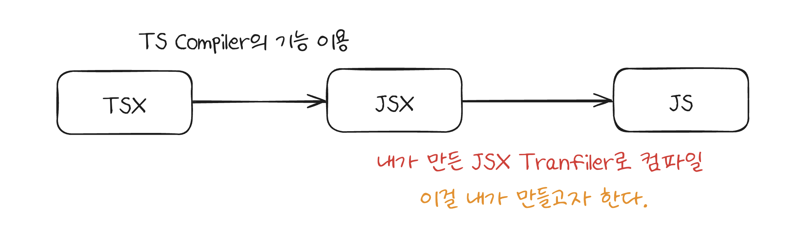
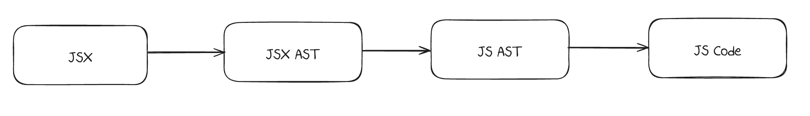

# 007_jsx 트렌스파일러 구현을 위한 계획 수립

## 🤔 왜 이해하려고 하는데?
006_JSX 트랜스파일러 구현을 위한 여정에서 확인할 수 있었듯이, 고수의 스킬을 배우기 위해서는 단순히 부딪히기 보다는 심도 있게 이해할 필요가 있었다.<br/>
그래야만 단순히 코드를 보고 따라치는 게 아니라, 그 동작 원리를 이해하고 나 나름의 방식으로 구현을 한 뒤, 이를 원본 코드와 비교해볼 수 있을 것만 같았기 때문이다.<br/><br/>

## 🥅 최종 목표
리액트 구현하기에서, JSX는 이제 시작에 불과하다. <br/>
그렇기에, 처음부터 길을 잃지 않도록 목적을 명확히 하는 것은 중요했다.<br/><br/>

내 목적은 매우 간단하다.<br/>
> 시중에서 사용되는 JSX 문법을 그대로 트랜스파일을 할 수 있는 트랜스파일러를 구현하는 것

<br/><br/>

|  |
| :---------------------: |
| 내가 하고자 하는 전체 과정은 위와 같다. |

<br/><br/><br/>

## 🤔 잠깐! 트렌스파일러가 뭔데?

[참고 :: 토스 문서](https://toss.tech/article/27750) <br/>

위의 토스 문서를 살펴보면 다음과 같이 설명하고 있다.<br/><br/>

> Transpiler는 코드를 변환하는 도구를 의미해요. JavaScript의 ES6 문법을 ES5 문법으로 변환하거나, React의 JSX 및 Typescript 코드를 브라우저가 이해할 수 있는 Javascript로 변환하는 도구에요. Transpiler 덕에 여러 브라우저 호환성을 유지하면서 다양한 문법을 활용할 수 있죠.

<br/><br/>

즉, 쉽게 말하면 트랜스파일러란 어떤 코드를 다른 코드로 변환하는 변환기이다.<br/>

| 특성         | 컴파일러                                                                  | 트랜스파일러                                          |
| ---------- | --------------------------------------------------------------------- | ----------------------------------------------- |
| **정의**     | 고수준 언어를 저수준 언어로 변환                                                    | 비슷한 수준의 언어 간 변환                                 |
| **입출력**    | 소스 코드 → 기계어/바이트코드                                                     | 소스 코드 → 소스 코드                                   |
| **추상화 수준** | 높은 수준 → 낮은 수준                                                         | 비슷한 수준 유지                                       |
| **출력 형태**  | 주로 바이너리/바이트코드 (인간이 읽기 어려움)                                            | 텍스트 형태의 소스 코드 (인간이 읽을 수 있음)                     |
| **주요 목적**  | 실행 가능한 코드 생성, 최적화                                                     | 호환성, 새 기능 사용, 크로스 브라우저 지원                       |
| **예시**     | GCC (C/C++ → 기계어)<br>Javac (Java → 바이트코드)                             | Babel (ES6+ → ES5)<br>TypeScript 컴파일러 (TS → JS) |
| **처리 과정**  | 1. 어휘 분석<br>2. 구문 분석<br>3. 의미 분석<br>4. 중간 코드 생성<br>5. 최적화<br>6. 코드 생성 | 1. 파싱 (AST 생성)<br>2. 변환 (AST 변환)<br>3. 코드 생성    |
| **실행 시점**  | 주로 실행 전 전체 처리 (AOT 컴파일)                                               | 개발 중 실시간 또는 빌드 과정의 일부                           |
| **코드 의미**  | 완전히 다른 형태로 변환 가능                                                      | 주로 원본 코드의 의미 유지                                 |
| **사용 환경**  | 주로 시스템 프로그래밍, 애플리케이션 개발                                               | 웹 개발, 크로스 플랫폼 개발                                |

<br/><br/>

그리고 컴파일러와는 위의 차이점을 보인다. <br/><br/><br/>


## 🍀 인터페이스가 명확하다.
이제부터는 JSX 트렌스파일러를 만들기 위한 과정에 대해서 논의를 해보자.<br/>
JSX에 대한 인터페이스는 명확하다.<br/>


|  |
|:--------------------------:|
|         JSX 맛보기         |

<br/>

그림은 위와 같이 표현했는데, 걍 따지고 보면 reactElement가 무엇인지 파악해서 해당 형식에 맞춰서 내보내주기만 하면 된다.<br/><br/>

다만, 이는 다시 말하면 그 인터페이스를 명확히 파악하는게 엄청 중요하다는 의미이기도 하다.<br/>
이미 명확하게 많이 사용되고 있는 게 `JSX`이고, 이들과 호환되게 트렌스파일러를 구현하기 위해서는 결국 사용하는 환경에 내가 구현할 기능을 끼워맞추는 게 맞기 때문이다.<br/><br/>

그렇기에 내가 중점으로 생각한 것은 `TDD`이다.<br/>
인터페이스 형식에 맞춰서 `Test`코드를 작성해두고, 이에 맞춰서 기능을 구현하는 것이다.<br/><br/>

하튼 이야기가 길었는데, 이정도면 내가 왜 `jsx`에 대해서 깊게 살펴보려는지 이해하리라.<br/><br/>

물론 깊게 본다는게 A부터 Z까지 본다는 것은 아니다.<br/>
그냥 `test` 코드를 작성할 수 있을 정도면 된다. <br/><br/><br/>

## 🗓️ 트렌스파일러 구현 계획

구현 계획은 다음과 같다.<br/><br/>

|  |
| :-------------------: |
|         구현 계획         |

<br/><br/>

간단하지만 위의 순서로 구현을 하고자 한다.<br/>
그리고, 처음부터 복잡한 요소에 대응하기 보다는 쉬운 것에 대응되는 것부터 시작해서, 천천히 확장을 해나가고자 한다.<br/><br/>

```jsx
const element = <h1>Hello, world!</h1>;
```

위의 코드를 바꿔보는 데에서 시작을 하고자 한다.<br/><br/><br/>


## 📚 참고자료
https://www.telerik.com/blogs/how-jsx-react-works-under-hood
https://github.com/facebook/jsx?tab=readme-ov-file
https://facebook.github.io/jsx/#sec-intro