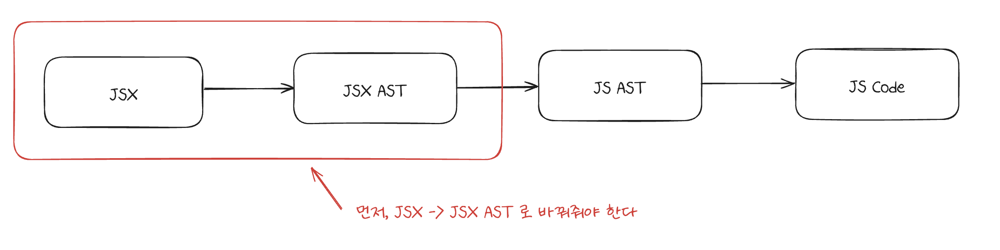

# 008_JSX에서 JSX AST 만들기에 앞선 학습하다가 생긴 고민

##  🤔 동기

JSX -> JS 트렌스파일러를 만들기로 결심하고, 제일 처음 과정은 다음과 같다.<br/><br/>

|  |
| :--------------------------------: |
|          JSX AST를 만들려는 목적          |

<br/>

쉽게 말하면 첫 스타트가 이것이기 때문에, 만들어보게 되었다. <br/><br/><br/>

## 🎯 목적

> JSX를 JSX AST(추상트리) 객체로 변환하는 코드 작성

<br/><br/>

간단히 말하면 위의 목표인데, 사실 트랜스파일러가 하는 게 좀 많다.. 그렇기에 좀 더 간단화할 필요가 있었다.<br/><br/>

```jsx
const element = <h1>Hello, world!</h1>;
```

<br/><br/>

이 코드를 JSX AST 객체로 만들어보는 것이다.<br/><br/><br/>

## 🤔 JSX란 무엇인가?

| JSX stands for JavaScript syntax extension. It is a JavaScript extension that allows us to describe React’s object tree using a syntax that resembles that of an HTML template. It is just an XML-like extension that allows us to write JavaScript that looks like markup and have it returned from a component. |
| ----------------------------------------------------------------------------------------------------------------------------------------------------------------------------------------------------------------------------------------------------------------------------------------------------------------- |
| [출처 : Progress Telerik](https://www.telerik.com/blogs/how-jsx-react-works-under-hood)                                                                                                                                                                                                                             |

인터넷에서 찾은 건데 잘 설명해주고 있다. 페이스북의 공식 설명은 아래와 같다. <br/><br/>

| JSX is an XML-like syntax extension to ECMAScript without any defined semantics. It's NOT intended to be implemented by engines or browsers. **It's NOT a proposal to incorporate JSX into the ECMAScript spec itself.** It's intended to be used by various preprocessors (transpilers) to transform these tokens into standard ECMAScript. |
| -------------------------------------------------------------------------------------------------------------------------------------------------------------------------------------------------------------------------------------------------------------------------------------------------------------------------------------------- |
| [출처 : facebook JSX github](https://facebook.github.io/jsx/#sec-intro)                                                                                                                                                                                                                                                                        |

<br/><br/>

쉽게 설명하면 XML과 유사한 문법을 제공하는 ECMAScript의 익스텐션이다. <br/>
단, 명시되어 있지만, 표준은 아니다. <br/><br/><br/>

## 🤔 react.createElement란?

결국 JSX는 `react.createElement` 함수를 사용하는 JS 코드로 변환된다. 그렇기에, `react.createElement`에 대해서 알아볼 필요가 있다.<br/><br/>

단, 검색해서 정리하는 것도 의미가 있지만 이미 앞에서 많이 살펴보았기에 이번에는 `AI`를 이용해서 정리를 해보았다.<br/><br/>

`perplexity`를 사용해서 찾아본 내용이다.

### react.createElement란?

React.createElement는 React에서 엘리먼트를 생성하는 함수입니다. 이 함수는 JSX를 사용하지 않고 React 엘리먼트를 만들 때 사용됩니다[](https://ko.react.dev/reference/react/createElement)[](https://devyihyun.tistory.com/186).

###  React.createElement의 기본 구조


```javascript
React.createElement(type, props, ...children)
```
- `type`: HTML 태그 이름(문자열) 또는 React 컴포넌트
- `props`: 엘리먼트의 속성을 나타내는 객체
- `children`: 자식 엘리먼트들[](https://ko.react.dev/reference/react/createElement)

### React.createElement의 역할
### 사용 예시

JSX를 사용한 코드:

```jsx
function Greeting({ name }) {return <h1 className="greeting">Hello, {name}!</h1>; }
```

React.createElement를 사용한 동일한 코드:

```javascript
function Greeting({ name }) {   return React.createElement(    'h1',    { className: 'greeting' },    'Hello, ',    name,    '!'  ); }
```

### 주의사항

1. **불변성**: createElement로 생성된 엘리먼트는 불변객체입니다. 한 번 생성되면 변경할 수 없습니다[](https://devyihyun.tistory.com/186).
2. **Legacy API**: React 팀에서는 createElement를 레거시 API로 분류했으므로, 일반적인 개발에서는 JSX 사용을 권장합니다[](https://29223.tistory.com/158).
3. **가독성**: JSX에 비해 createElement를 직접 사용하면 코드의 가독성이 떨어질 수 있습니다[](https://dev-astra.tistory.com/581)[](https://lakelouise.tistory.com/84).

React.createElement는 React의 기본 메커니즘을 이해하는 데 도움이 되지만, 실제 개발에서는 JSX를 사용하는 것이 더 편리하고 가독성이 좋습니다[](https://dev-astra.tistory.com/581)


<br/><br/><br/>

## 🤔 react.createElement와  document.createElement의 차이점은?

React.createElement와 document.createElement의 주요 차이점을 다음과 같이 표로 정리할 수 있다<br/><br/>

| 특성       | React.createElement        | document.createElement  |
| -------- | -------------------------- | ----------------------- |
| 생성 객체    | React 엘리먼트(가상 DOM 객체)      | 실제 DOM 엘리먼트             |
| 사용 환경    | React 애플리케이션               | 일반 JavaScript 환경        |
| 반환 값     | JavaScript 객체(React 엘리먼트)  | 실제 DOM 노드               |
| 파라미터     | (type, props, ...children) | HTML 태그 이름              |
| 속성 설정    | props 객체로 한 번에 설정          | 개별적으로 설정                |
| 자식 요소 처리 | 파라미터로 직접 전달                | appendChild() 등으로 별도 추가 |
| 변경 가능성   | 불변(immutable)              | 변경 가능(mutable)          |
| 렌더링 과정   | Virtual DOM 통한 최적화         | 직접 DOM 조작               |
<br/><br/>

즉, `react.createElemenet`는 리엑트의 `virtual DOM`을 비롯하여 여러 기능들에 특화된 `가상 DOM 객체`라고 할 수 있겠다.<br/><br/><br/>

## 🎯 최종 방향성 재수립

사실 의도한건 아닌데, 여기서 내가 최종적으로 트렌스파일러로 구현해야하는 목표가 보였다.<br/><br/>

최종적으로 트랜스파일러를 통해서 나와야하는 객체는 `reactElement` 형태이다.<br/>
그래야, 나중에 `virtual DOM` 등을 구현하고, 최종적으로 리액트의 핵심 기능이 담긴 미니 리엑트를 만들어볼 수 있기 때문이다.<br/><br/>

그렇기에, 내가 만드는 트렌스파일러는 `react.createElement`를 사용하는 형태의 `js`로 트렌스파일링 할 필요가 있다.<br/><br/>

## 🤔 reactElement란?

이제, `react.createElement`가 뭔지는 알겠다. 결과적으로 `virtual DOM`을 사용하는 `reactElement`를 만드는 함수이다.<br/><br/>

그러면 `reactElement`란 무엇인가?<br/><br/>

### What is a React element, exactly?

An element is a lightweight description of a piece of the user interface. For example, both `<Greeting name="Taylor" />` and `createElement(Greeting, { name: 'Taylor' })` produce an object like this:

```
// Slightly simplified{  type: Greeting,  props: {    name: 'Taylor'  },  key: null,  ref: null,}
```

**Note that creating this object does not render the `Greeting` component or create any DOM elements.**

A React element is more like a description—an instruction for React to later render the `Greeting` component. By returning this object from your `App` component, you tell React what to do next.

Creating elements is extremely cheap so you don’t need to try to optimize or avoid it.

[출처 : react 공식문서](https://react.dev/reference/react/createElement#what-is-a-react-element-exactly)

<br/><br/>

리액트 공식문서에 따르면 위와 같이 정의하고 있다.<br/><br/>

그리고 최근 굉장히 친해진 `perplexity`에 따르면 다음과 같이 정리할 수 있다.<br/><br/>


### ReactElement란?
ReactElement는 React 애플리케이션에서 UI를 구성하는 가장 기본적인 단위입니다. 다음은 ReactElement의 주요 특징과 개념입니다: <br/><br/>

### ReactElement의 정의

ReactElement는 화면에 렌더링할 내용을 설명하는 불변의 JavaScript 객체입니다[1]. 이는 실제 DOM 요소나 사용자 정의 컴포넌트를 표현합니다[2]. <br/><br/>

### ReactElement의 구조

ReactElement는 주로 다음과 같은 속성을 가집니다: <br/><br/>

1. **type**: 문자열(HTML 태그명) 또는 React 컴포넌트 함수/클래스[2]
2. **props**: 엘리먼트의 속성을 나타내는 객체[2]
3. **children**: 자식 엘리먼트들 (props의 일부로 취급됨)[1]
<br/><br/>
### ReactElement의 특징

1. **불변성**: 한 번 생성된 ReactElement는 변경할 수 없습니다[1][4].
2. **가벼움**: 실제 DOM 노드보다 훨씬 가볍고 효율적입니다[3].
3. **Virtual DOM**: ReactElement들로 구성된 트리는 Virtual DOM을 형성합니다[2].

<br/><br/>
### ReactElement의 생성

<br/><br/>

ReactElement는 주로 두 가지 방법으로 생성됩니다:

1. **JSX 사용**: 
   ```jsx
   const element = <h1>Hello, World!</h1>;
   ```

2. **React.createElement() 함수 사용**:
   ```javascript
   const element = React.createElement('h1', null, 'Hello, World!');
   ```

<br/><br/>
### ReactElement vs DOM Element

<br/><br/>

- ReactElement는 실제 DOM 요소를 표현하는 JavaScript 객체입니다.
- DOM Element는 브라우저의 실제 DOM 노드입니다.
- React는 ReactElement를 사용하여 필요한 경우에만 실제 DOM을 업데이트합니다[4].

<br/><br/>

### ReactElement의 렌더링

<br/><br/>

ReactElement는 ReactDOM.render() 또는 최신 버전의 React에서는 ReactDOM.createRoot().render() 메서드를 통해 실제 DOM에 렌더링됩니다[4].

<br/><br/>

### 결론

<br/><br/>

ReactElement는 React 애플리케이션의 UI를 구성하는 기본 단위로, 가볍고 효율적인 방식으로 UI를 표현하고 관리할 수 있게 해줍니다. 이를 통해 React는 성능 최적화와 선언적 UI 프로그래밍을 가능하게 합니다.

<br/><br/>

Citations:
[1] https://devyihyun.tistory.com/186
[2] https://it-eldorado.tistory.com/82
[3] https://seokzin.tistory.com/entry/React-%EC%97%98%EB%A6%AC%EB%A8%BC%ED%8A%B8%EC%99%80-%EC%BB%B4%ED%8F%AC%EB%84%8C%ED%8A%B8-Element-Component-JSX
[4] https://ko.legacy.reactjs.org/docs/rendering-elements.html
[5] https://www.youdad.kr/react-element-and-component/

<br/><br/><br/>

대충 정리하면, `virtualDOM` 을 위한 요소라고 볼 수 있다.<br/>
그런데 내가 원하는 것은 이런 정보가 아니다. 이건 이미 앞에서 알아봤고, 한 걸음 더 나아가서 내가 원하는 것은 이 객체가 어떤 형태를 갖는 것인지 구체적인 예시가 필요하다.<br/><br/><br/>

## 🤔 reactElement의 구체적인 예시

```javascript
const element = React.createElement(
	'div', 
	{ className: 'container', id: 'main' }, 
	React.createElement('h1', null, 'Hello'), 
	React.createElement('p', null, 'This is a paragraph.') );
```

다음과 같은 코드가 있다고 가정을 했을때, 이는 아래와 같이 변환이 된다. <br/><br/>

```javascript
{  
  $$typeof: Symbol(react.element),  
    type: 'div',  
  key: null,  
  ref: null,  
  props: {  
  className: 'container',  
    id: 'main',  
    children: [  
    {  
      $$typeof: Symbol(react.element),  
      type: 'h1',  
      key: null,  
      ref: null,  
      props: {  
        children: 'Hello'  
      },  
      _owner: null,  
      _store: {}  
    },  
    {  
      $$typeof: Symbol(react.element),  
      type: 'p',  
      key: null,  
      ref: null,  
      props: {  
        children: 'This is a paragraph.'  
      },  
      _owner: null,  
      _store: {}  
    }  
  ]  
},  
  _owner: null,  
    _store: {}  
}
```

<br/><br/><br/>

## 🤔 AST란 무엇인가?

이로 인해서 대충 전체적으로 어떻게 동작하는 지 이해할 수 있었으리라.<br/>
그러면 이제, 본격적으로 `JSX -> JSX AST` 를 만들기 위한 과정을 진행해보자.<br/><br/>

제일 먼저 해야하는 것은 명확하다. `JSX`는 알았는데, `AST`란 무엇인가?<br/><br/>

[참고자료 : 자바스크립트 개발자를 위한 AST(번역)](https://gyujincho.github.io/2018-06-19/AST-for-JS-devlopers)<br/><br/>

위 글을 참고하였다. 발췌한 내용을 참고하면 다음과 같다. <br/>
> AST는 프로그래밍 언어의 문법에 따라 소스 코드 구조를 표시하는 계층적 프로그램 표현 (respresentation) 입니다. 각 AST 노드는 소스 코드의 항목(item)에 해당합니다.

<br/><br/>

위 요소에 따르면 AST는 결국 어떤 텍스트를 분석해서 트리 형태로 만든 것이다.<br/><br/>

다만, 어떻게 해야한다는 표준이 존재하는 것은 아니라서, 각 언어의 특징에 맞춰서 조금씩 다른 형태를 띈다. <br/><br/>

기본적으로 다음의 과정을 따른다.<br/><br/>

||
|:---:|
|문자열이 AST가 되는 과정|

## 🤔 AST를 살펴보면서 생긴 고민

처음에는 그냥 AST 구조를 따라서 그 속성을 구현해보고자 했다. 즉, `Lexor`와 `Parser` 모두를 만드는 것이다.<br/><br/>

그리고, 테스트 코드를 작성해서, 내가 작성한 기능에 정해진 인풋을 넣고 아웃풋이 제대로 맞는 지 확인하고자 했다.<br/><br/>

이를 위해서 어떤 기준의 `AST` 를 만들지 알아봐야 했고, 다음과 같은 레퍼런스를 찾게 되었다.<br/>

| 레퍼런스                                                                                                      | 설명                         |
| --------------------------------------------------------------------------------------------------------- | -------------------------- |
| [JSX AST](https://github.com/facebook/jsx/blob/main/AST.md)                                               | JSX의 AST 구문을 페이스북이 명세한 내용  |
| [ESTree](https://github.com/estree/estree)                                                                | JSX가 바탕으로한 AST 명세          |
| [Babel AST](https://github.com/jamiebuilds/babel-handbook/blob/master/translations/ko/plugin-handbook.md) | Babel에서 사용하고 있는 AST에 대한 설명 |

그리고 최근에 가장 많이 들어본 `Babel`을 참고하기로 하였다.<br/><br/>

그러나, 이렇게 보다보니 한 가지 의문이 들었다.<br/><br/>

`Babel`의 플러그인 핸드북에 따르면, 바벨은 다음의 과정을 거친다.<br/>
분석(Parse), 변환(Transform), 생성(Generate)<br/><br/>

근데, 놓고 보니 AST를 만드는 과정이 만만치가 않았다.<br/>
이를 위해서는 다음과 같은 과정이 필요했다.<br/><br/>

1. Babel에서 사용하는 AST에 대한 이해<br/>    - 여기에는 `ESTree`가 포함된다.
2. 그리고 이 AST 양식에 맞추어서 코드를 작성해야한다.
3. 그러고나면, 이제 AST 구성이 끝난다.

다만, 명세를 이해하기도 힘들 뿐더러, `React`를 바탕으로 한 고수들의 코딩 방법을 이해하자라는 목적에 적합한가? 하는 생각이 들었다. <br/><br/>

그래서, 이건 그냥 있는 도구를 가져다 쓰고, 만들어진 AST에 대해서 JS JSX로 바꾸고, 다시 JS로 바꿔볼까 하는 생각을 하게 되었다.<br/><br/>

다만 이렇게 하면 크게 남는게 없겠다는 생각도 들었다.<br/>
그러면 트랜스파일러의 핵심 기능은 그냥 다 도구를 쓰는거고 난 굳이? 하는 작업이 되기 때문이다.<br/><br/>

이럴꺼면 트랜스파일러를 건너뛰고, 그냥 바로 `createElement`로 시작해서 `reactElement`를 파싱하는 형태로 구현을 하는 게 낫지 않을까? 하는 생각이 들었다.<br/><br/>

그렇지만, 반대로 이걸 해보면 큰 성장을 이룰 것 같았고.<br/>
주어진 기간은 2주. 고민을 해보게 되었다... 어떻게 해야하는가...<br/><br/><br/>

## 🤔 하지말자
간단하다. 하지말자.<br/><br/>

트렌스파일러 만드는건 조금 뒤로 미루자. 인터미션때로 미루자.<br/><br/>

리엑트를 참고삼아 거기에 담겨있는 노하우를 배우겠다고 했는데, JSX로 너무 큰 시간을 쏟는 느낌.<br/><br/>

학습한건 언젠가 해야했으니, 그런 의미로 남겨두자.<br/><br/>

다시 본질로 돌아가자<br/><br/><br/>