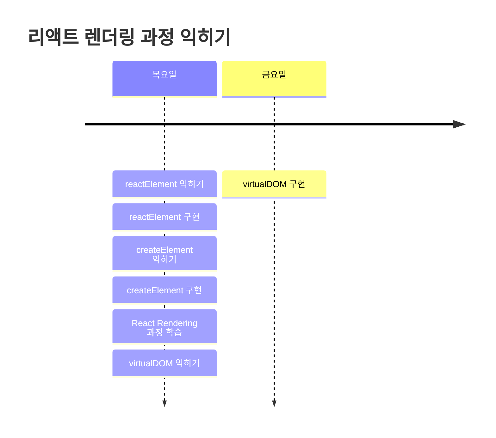

# 009 태초마을에서 다시 시작하다

## 🤔 왜 다시 처음으로?
JSX에 빠져서, 본질을 많이 놓히고 있다는 생각이 들었다.  

학습하는 과정 자체는 굉장히 큰 의미가 있었지만, 트렌스파일러를 구현하는 것은 당초 목적했던 것과는 많이 멀어진 느낌이다.  

그래서, 트렌스파일러 구현은 조금 미루고 다시 처음으로 돌아가고자 한다.    

## 🎯 다시금 잡는 목표

> 리액트의 핵심 기능 하나를 구현해보면서 완전 제대로 익힌다.

너무 많은 것을 생각하지 않고, 너무 많은 것을 하지 않으려고 한다. 
아주 작은 것에서 시작해서 살 붙이는 느낌으로 그렇게 해보고자 한다.    

## 🧐 어떤 것을 구현하면서 제대로 익힐 것인가?

> React Virtual DOM을 구현해보면서 리엑트의 렌더링 과정을 배워보고자 한다.

이런 목표를 잡은 데에는 다음과 같은 이유가 있다.  

| 이유                                  | 설명                                                                                                                                                                                           |
| ----------------------------------- | -------------------------------------------------------------------------------------------------------------------------------------------------------------------------------------------- |
| 모던한 `DOM` 조작 방법과 최적화 기법을 배우고 싶었다.   | ▸ 4주 간의 과정을 통해서 `Vanilla JS`를 통한 DOM 조작 방법에 대해서 경험하고 관련 지식을 익힐 수 있었다.  ▸ 이제는 여기서 좀 더 나아가서 발전된 `DOM` 조작 및 최적화 기법을 경험하며 배우고 싶었다.                                                       |
| 많은 이야기를 들었고, 이게 과연 무엇인지 제대로 알고 싶었다. | ▸ 항상 `React`라고 하면 꼭 같이 나오는 이야기가 `Virtual DOM`과 관련된 이야기였다.   ▸ 실제로, `React`가 `선언형 UI`를 이륙하기 위해 채택한 것이 `Virtual DOM`으로 알고 있는데, `Meta`는 어떤 원리로 이를 구현했으며, 최적화를 했는지 궁금했다.              |
| 모든 것의 시작점이라고 생각했다.                  | ▸ 리엑트 구현은 꾸준하게 이어가고 싶은 프로젝트 중 하나이다.  ▸ 그리고, `React`의 어떠한 기능들을 구현해보기 위해서는 그 기능들이 적용될 대상이 필요했다. ▸ 그게 `Virtual DOM`이라고 생각했다.                                                        |
| 리액트의 전체 렌더링 방식을 이해하고 싶었다.           | ▸ `Front-End`관련된 프레임워크나 라이브러리는 `개발의 불편함`, `DOM 조작 최적화`에 대한 문제를 해결하기 위해 나왔다고 생각했다.  ▸ 다양한 도구 중 요즘 가장 많이 쓰이는 `React`는 어떻게 이런 문제에 접근하고 있는지에 대해, `React`의 전체 렌더링 과정을 직접 구현하면서 이해해보고 싶었다. |

   

## 🤔 어떻게 진행할 것인가?

일단, 나는 `React`에 대해서 잘 알지 못한다. 
그렇기에, `React`의 전체적인 이해부터 시작을 할 필요가 있었다.  

본 프로젝트에 한해서는 큰 것에서 시작해서, 작은 것을 이해할 필요가 있었다. 
구현 자체는 작은 것에서 큰 것으로 확장할 필요가 있고 말이다.  

그래서 다음과 같은 방식을 채택했다. 

1. `React`란 무엇인지 배운다.
2. `React`가 등장할 당시 어떤 철학을 가졌는지 살펴본다. - `초기`를 기준으로 잡은 이유는 지금의 리엑트는 너무나도 고도화되었고, 점점 더 큰 가치를 추구하게 되었기 때문이다. 그래서 아주 작은 본질을 보려면 초창기 리엑트를 기준으로 삼아야하는게 아닌가? 싶었다.
3. `React`의 `Rendering` 방식에 대한 전체적인 프로세스를 이해한다.
4. `React`가 `DOM` 조작과 관련하여 어떤 방식으로 진행하는지 전체적인 프로세스를 이해한다. - 적고보니, 아마 3번과 동시에 학습을 하게 되지 않을까 생각된다.
5. 대략적인 이론을 이해했으면, 더 깊게 공부하기보다는 냅따 구현을 시작한다. 그리고 이제는 부딪히면서 깊게 파보자.

 

> 이에 대한 과정을 아주 천천히 작은 것부터 시작해서 진행하고자 한다.

   

## 🗓️ 다시 세우는 일정

