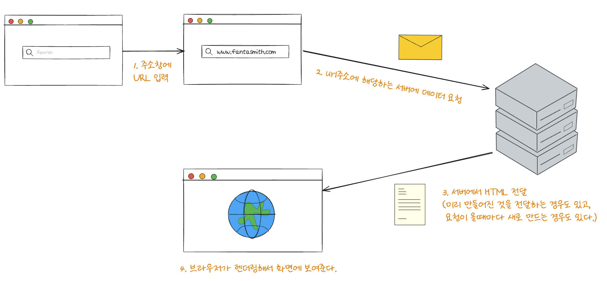

# DOM과 브라우저 렌더링

## 📚 개요
순수하게 HTML/CSS/JS를 이용해서 간단한 풀스택 개발을 경험해볼 일이 있었습니다. 
여러 불편함을 맞닥뜨리고 그걸 개선하는 과정에서 `web component`기능 중 하나인 `custom component`를 사용하게 되었고, 그 과정에서 `DOM` 객체를 깊게 다루는 경험을 할 수 있었습니다.  

다만, 그 과정이 평탄치는 않았습니다.  처음 겪어보는 경험인 만큼 정말 많은 구조적인 문제와, 불편함을 직면하게 되었죠. 그리고, 그 요소의 대부분은 제가 `DOM`과 브라우저 렌더링 과정을 제대로 이해하지 못해서 벌어진 일이었습니다.  

주먹구구식으로 학습을 하다가, `SSR`, `CSR` 에 대한 이야기도 많이 들리고, 제가 **과연 이 개념들을 제대로 이해하고 있는가?** 라는 의문도 들어서 이번 기회에 제대로 정리를 해보자는 생각에 이렇게 글을 적게 되었습니다.  

지금부터 다룰 이야기는 `DOM`이란 무엇인가와, 그리고 이 `DOM`이 브라우저에 어떻게 렌더링이 되는가에 대해 적어보고자 합니다. 

## 📚 설명 방식
저 개인적으로는 학습을 할 때 상황이 머릿속에 그려지면 좀 더 쉽게 학습을 할 수 있었습니다. 
이는 지금부터 이야기 할 내용에도 적용이 되는 부분이라고 생각합니다. 
그래서 지금부터는, 처음 브라우저의 주소창에 `URL`을 입력하였을 때부터 화면에 출력될 때 까지 어떤 일이 벌어지는 지에 대해서 이야기를 해보면서 다른 개념들을 풀어나가려 합니다. 
개념들은 과정에 따라서 설명하고, 마지막에 `SSR`과 `CSR`의 차이에 대해서 이야기를 하면서 마치고자 합니다. 자세한 내용은 목차를 참고해주시면 좋을 듯 합니다.

## 📚 도메인을 쳐서 화면에 도달하기까지

<table align="center">
<thead>
</thead>
<tbody>
<tr align="center">
<td>

</td>
</tr>
<tr align="center">
<td>
주소창부터 렌더링까지의 과정
</td>
</tr>
</tbody>
</table>

## 📚 브라우저에서 주소를 입력했을 때 벌어지는 일

## 📚 요청을 받았을 때 서버에서는 어떤 일이 일어나는가?

## 📚 

## 📚 용어를 명확히 하는 것의 중요성
이야기를 하기 전에 한 가지를 논해보고 가면 좋을 것 같습니다. 

## 📚 렌더링이란 무엇인가?
- 브라우저 렌더링에 대한 이야기

## 📚 브라우저는 어떻게 렌더링을 하는가?
- 전체 과정에 대한 이야기, 그리고 이해가 어려울 테니 하나씩 살펴보자는 이야기
